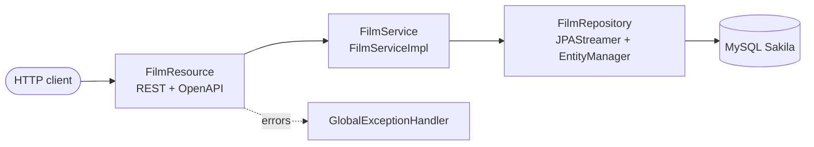

# Code With Quarkus: Sakila Film API


A REST API built with **Quarkus**, **JPAStreamer** and **MySQL** on top of the [Sakila sample database](https://dev.mysql.com/doc/sakila/en/) (a DVD rental store: films, actors, customers, rentals...).

The project goes beyond a basic tutorial: it uses a layered architecture (resource, service, repository), DTOs, global exception handling, request validation and complete OpenAPI documentation.

## Table of contents

- [Features](#features)
- [Tech stack](#tech-stack)
- [Architecture](#architecture)
- [Prerequisites](#prerequisites)
- [Getting started](#getting-started)
- [Configuration](#configuration)
- [API endpoints](#api-endpoints)
- [Error handling](#error-handling)
- [API documentation](#api-documentation)
- [Why Quarkus](#why-quarkus)
- [Running the application in dev mode](#running-the-application-in-dev-mode)
- [Packaging and running the application](#packaging-and-running-the-application)
- [Creating a native executable](#creating-a-native-executable)
- [Troubleshooting](#troubleshooting)
- [Author](#author)

## Features

- Browse films by minimum length, with pagination (20 per page)
- Fetch a single film by id
- Search films by title prefix, including their cast (film and actor many-to-many join)
- Bulk update of the rental rate for all films longer than a given length
- Type-safe, stream-based database queries with JPAStreamer
- Consistent JSON error responses (400, 404, 500) through a global exception handler
- Input validation with Bean Validation
- Auto-generated OpenAPI specification and interactive Swagger UI
- One-command database setup with Docker Compose

## Tech stack

| Layer | Technology |
|---|---|
| Framework | Quarkus 3.x |
| Language | Java 21 |
| REST | Quarkus REST (`quarkus-rest`, `quarkus-rest-jackson`) |
| Persistence | Hibernate ORM + JPAStreamer (`quarkus-jpastreamer`) |
| Database | MySQL 5.7 (Sakila dataset, `restsql/mysql-sakila` image) |
| Validation | Hibernate Validator (`quarkus-hibernate-validator`) |
| API docs | SmallRye OpenAPI + Swagger UI (`quarkus-smallrye-openapi`) |
| Build | Maven (Maven Wrapper included) |
| Local infrastructure | Docker Compose |

## Architecture

Each layer has a single responsibility and only talks to the layer below it.



| Layer | Responsibility |
|---|---|
| `resource` | HTTP endpoints, input validation, OpenAPI annotations |
| `service` | Business logic, transactions, entity to DTO mapping |
| `repository` | Database access (JPAStreamer queries, `EntityManager`) |
| `model` | JPA entities (`Film`, `Actor`) |
| `dto` | API contract (records returned to clients) |
| `exception` | Business exceptions and the global exception handler |
| `config` | OpenAPI definition |

### Project structure

```
.
├── docker-compose.yml
├── pom.xml
└── src/main
    ├── java/org/omar
    │   ├── config/        OpenApiConfig
    │   ├── dto/           FilmDto, ActorDto, FilmWithActorsDto, ErrorResponse
    │   ├── exception/     FilmNotFoundException, GlobalExceptionHandler
    │   ├── model/         Film, Actor
    │   ├── repository/    FilmRepository
    │   ├── resource/      FilmResource
    │   └── service/       FilmService
    │       └── Impl/      FilmServiceImpl
    └── resources
        └── application.properties
```

## Prerequisites

- JDK 21
- Docker Desktop (or any Docker engine with Compose)
- Maven is optional: the included Maven Wrapper (`./mvnw`) downloads it automatically

## Getting started

**1. Clone the repository**

```bash
git clone https://github.com/drissiOmar98/code-with-quarkus.git
cd code-with-quarkus
```

**2. Start the database**

```bash
docker compose up -d
docker compose logs -f
```

Wait until the logs show that MySQL is ready for connections. The database is then available on `localhost:3306`.

**3. Start the application**

```bash
./mvnw compile quarkus:dev
```

**4. Try it**

```bash
curl http://localhost:8080/films/1
```

```json
{
  "id": 1,
  "title": "ACADEMY DINOSAUR",
  "length": 86,
  "rentalRate": 0.99
}
```

## Configuration

Main settings in `src/main/resources/application.properties`:

| Property | Value | Purpose |
|---|---|---|
| `quarkus.datasource.db-kind` | `mysql` | Database type |
| `quarkus.datasource.jdbc.url` | `jdbc:mysql://localhost:3306/sakila` | Connection URL (port must match `docker-compose.yml`) |
| `quarkus.datasource.username` / `password` | `root` / `sakila` | Credentials of the Sakila image (local development only) |
| `quarkus.datasource.db-version` | `5.7.17` | Tells Hibernate which MySQL version it talks to (see [Troubleshooting](#troubleshooting)) |
| `quarkus.hibernate-orm.log.sql` | `true` | Prints generated SQL in the console |
| `quarkus.swagger-ui.always-include` | `true` | Keeps Swagger UI in packaged builds |

> The credentials above are the default ones of the public sample image. Never commit real secrets: use environment variables, for example `quarkus.datasource.password=${DB_PASSWORD:sakila}`.

## API endpoints

| Method | Path | Description |
|---|---|---|
| `GET` | `/films/{filmId}` | Get a film by id |
| `GET` | `/films?page=0&minLength=0` | List films longer than `minLength`, 20 per page, sorted by length |
| `GET` | `/films/with-actors?titlePrefix=A&minLength=0` | Films whose title starts with `titlePrefix`, with their cast |
| `PUT` | `/films/rental-rate?minLength=120&rentalRate=2.99` | Update the rental rate of all films longer than `minLength` |

Examples:

```bash
curl "http://localhost:8080/films?page=0&minLength=100"
curl "http://localhost:8080/films/with-actors?titlePrefix=A&minLength=100"
curl -X PUT "http://localhost:8080/films/rental-rate?minLength=120&rentalRate=2.99"
```

## Error handling

All errors share the same JSON shape, produced by `GlobalExceptionHandler`.

| Status | When |
|---|---|
| `400 Bad Request` | Invalid input (negative length, malformed value...), with per-field `details` |
| `404 Not Found` | Unknown film id |
| `500 Internal Server Error` | Unexpected failure (generic message; the real cause is only logged server-side) |

```json
{
  "timestamp": "2026-10-04T10:15:30.123Z",
  "status": 404,
  "error": "Not Found",
  "message": "No film found with id 9999",
  "path": "/films/9999"
}
```

## API documentation

The OpenAPI specification is generated from the code and annotations (`@Operation`, `@APIResponse`, `@Schema`).

| What | URL (dev mode) |
|---|---|
| Swagger UI | http://localhost:8080/q/swagger-ui/ |
| OpenAPI spec | http://localhost:8080/q/openapi |
| Quarkus Dev UI | http://localhost:8080/q/dev/ |

## Why Quarkus

[Quarkus](https://quarkus.io/) is a Kubernetes-native Java framework designed for fast startup, low memory usage and a great developer experience. This project uses it for:

- **Live coding:** change code, configuration or entities and the application reloads on the next request, with no manual restart.
- **Dev UI:** an in-browser console to inspect beans, configuration, endpoints and extensions.
- **Extension model:** each capability (REST, Hibernate ORM, validation, OpenAPI, JPAStreamer) is added as a dependency and configured through `application.properties`.
- **Build-time processing:** Quarkus does most of the framework wiring at build time, which gives quick startup and a small memory footprint.
- **Native compilation:** the same code can be compiled to a native executable with GraalVM (see [below](#creating-a-native-executable)).
- **CDI and constructor injection:** services and repositories are plain `@ApplicationScoped` beans injected through constructors.

Useful guides: [Quarkus REST](https://quarkus.io/guides/rest), [Hibernate ORM](https://quarkus.io/guides/hibernate-orm), [Validation](https://quarkus.io/guides/validation), [OpenAPI and Swagger UI](https://quarkus.io/guides/openapi-swaggerui), [JPAStreamer](https://jpastreamer.org/).

## Running the application in dev mode

You can run your application in dev mode that enables live coding using:

```bash
./mvnw compile quarkus:dev
```

> **Note:** The Quarkus Dev UI is available in dev mode only at http://localhost:8080/q/dev/.

> **Note:** To test your endpoints using Swagger, visit http://localhost:8080/q/swagger-ui/.

## Packaging and running the application

The application can be packaged using:

```bash
./mvnw package
```

It produces the `quarkus-run.jar` file in the `target/quarkus-app/` directory.

> **Note:** Be aware that it is not an uber-jar as the dependencies are copied into the `target/quarkus-app/lib/` directory.

The application is now runnable using:

```bash
java -jar target/quarkus-app/quarkus-run.jar
```

If you want to build an uber-jar, execute the following command:

```bash
./mvnw package -Dquarkus.package.jar.type=uber-jar
```

The application, packaged as an uber-jar, is now runnable using:

```bash
java -jar target/*-runner.jar
```

> **Note:** The database must be running (`docker compose up -d`) before starting a packaged application.

## Creating a native executable

You can create a native executable using:

```bash
./mvnw package -Pnative
```

Or, if you don't have GraalVM installed, you can run the native executable build in a container using:

```bash
./mvnw package -Pnative -Dquarkus.native.container-build=true
```

You can then execute your native executable with:

```bash
./target/quarkus-tutorial-1.0.0-SNAPSHOT-runner
```

## Troubleshooting

**`Persistence unit '<default>' was configured to run with a database version of at least '8.0.0', but the actual version is '5.7.17'`**
The Sakila image runs MySQL 5.7 while Hibernate 6 assumes MySQL 8 by default. Set `quarkus.datasource.db-version=5.7.17` in `application.properties`.

**`Cannot resolve symbol 'Film$'`**
`Film$` is the JPAStreamer metamodel, generated at compile time. Run `./mvnw clean compile`, then in IntelliJ enable annotation processing and reload the Maven project.

**`Cannot compare left expression of type 'java.lang.Short' with right expression of type 'java.lang.Object'`**
Lookup by id uses `EntityManager.find` instead of a JPAStreamer `equal` filter on the `Short` primary key.

**Port 3306 already in use**
Change the host port in `docker-compose.yml` (for example `"3307:3306"`) and update the JDBC URL accordingly.

## Author

Built by [drissiOmar98](https://github.com/drissiOmar98).
